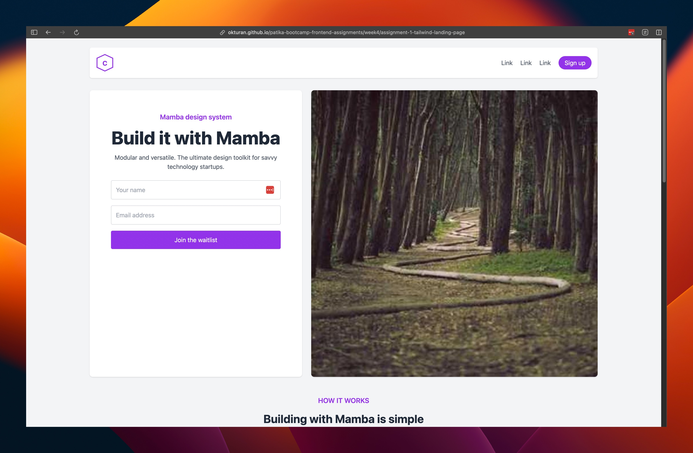

# Introduction

This is a practice project for exploring and using Tailwind CSS. This project showcases various layouts and components built using the utility-first CSS framework.

## Live Demo

You can see a live demo of the project at the following link:
[Live Demo](https://okturan.github.io/patika-bootcamp-frontend-assignments/week4/assignment-1-tailwind-landing-page/)

## Screenshot

## Features

- Responsive layout
- Various components styled with Tailwind CSS
- Light and clean design
