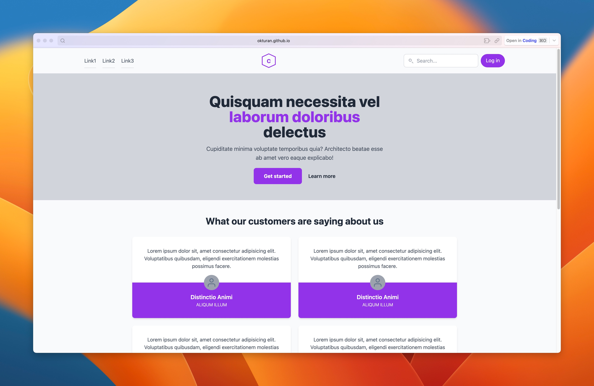

# Introduction

This is a new project for creating a versatile and responsive contact page using the Tailwind CSS framework. The project emphasizes clean design and user-friendly components.

## Live Demo

You can see a live demo of the project at the following link:
[Live Demo](https://okturan.github.io/patika-bootcamp-frontend-assignments/week4/assignment-2-tailwind-review-page/)

## Screenshot

## Features

- Responsive design tailored for desktop and mobile
- Interactive components including testimonials and a contact form
- Modern, clean aesthetic with a focus on usability
