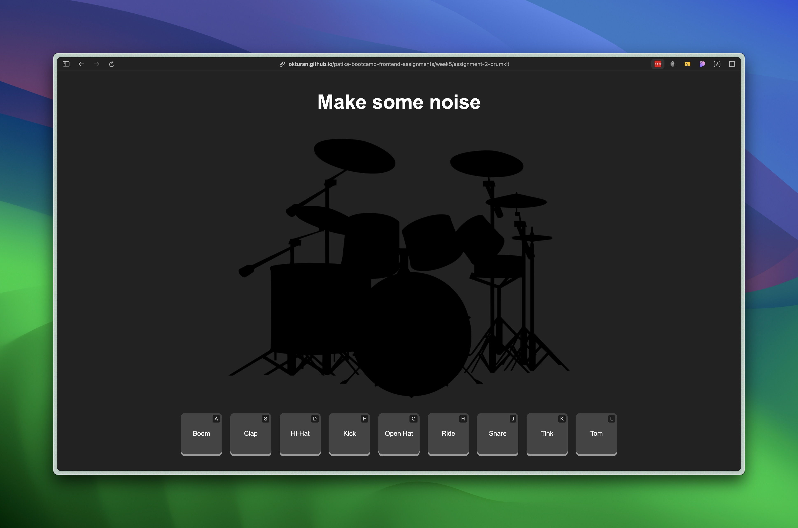

# Drum Kit Assignment

This project is a simple web-based drum kit that allows users to play different drum sounds using mouse clicks or keyboard presses. The sounds are preloaded and played back with minimal delay for a responsive experience.

## Getting Started

To use the drum kit, visit the following link in your web browser:

[Drum Kit Simulator](https://okturan.github.io/patika-bootcamp-frontend-assignments/week5/assignment-2-drumkit/)

### Files

- **index.html**: The main HTML file that includes the structure of the drum kit.
- **styles.css**: Contains the styles for the drum buttons and animations.
- **app.js**: The JavaScript file that handles sound playback and animations.
- **sounds/**: A folder containing the drum sound files (`.wav` format).

### Usage

1. Click on any drum button to play the corresponding sound.
2. Alternatively, use the keyboard keys (`A`, `S`, `D`, `F`, `G`, `H`, `J`, `K`, `L`) to play different drum sounds.

## How It Works

- The JavaScript file (`app.js`) initializes an `AudioContext` to manage sound playback more efficiently.
- All drum sound files are preloaded asynchronously when the page loads.
- The `playSound` function is called when a user clicks a button or presses a key. It uses the `AudioContext` to play the appropriate sound with minimal delay.
- The `animateButton` function adds a temporary animation effect to the button being clicked or pressed.

## Customization

- To change the sound files, replace the existing `.wav` files in the `sounds` directory with new ones, ensuring they have the same filenames.
- Modify `styles.css` to change the look and feel of the drum buttons and animations.

## Troubleshooting

- If the sounds do not play immediately, ensure that all sound files are correctly placed in the `sounds` directory.
- Check the console for any errors related to file paths or loading issues.

## Additional Notes

- Some browsers may require a user interaction (like clicking on the page) to allow audio playback due to security settings.
- Make sure to test the drum kit in different browsers to ensure compatibility.

## License

This project is for educational purposes and does not have a specific license.
