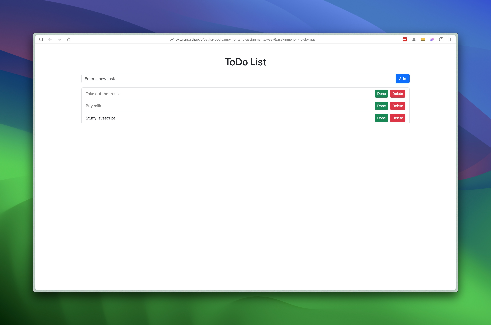

# ToDo App

A simple and user-friendly ToDo application to help manage tasks..

## Live Demo

Check out the live version of the app 

[To-do app](https://okturan.github.io/patika-bootcamp-frontend-assignments/week5/assignment-2-drumkit/)

## Features

- **Add Tasks:** Quickly add new tasks to your list.
- **Delete Tasks:** Remove tasks that are no longer needed.
- **Mark as Completed:** Easily mark tasks as done.
- **Persistent Storage:** Your tasks are saved and persist across sessions.

## Technologies Used

- **HTML5**
- **CSS3**
- **JavaScript**
- **Bootstrap 5**
- **Bootstrap Icons**
