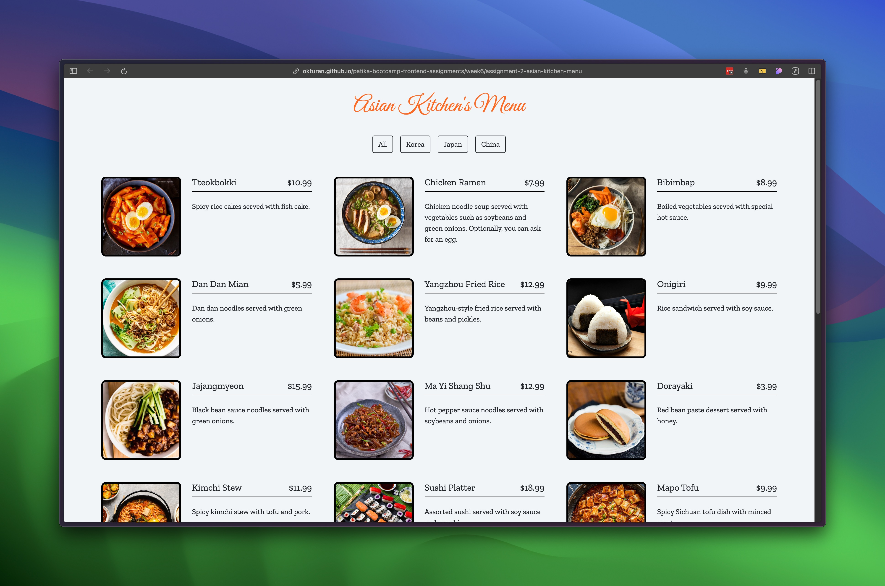

# Asian Kitchen Menu

Welcome to the **Asian Kitchen Menu** project! This dynamic, web-based menu allows users to explore and filter a variety of Asian dishes from Korea, Japan, and China using Javascript for interactivity.

## Getting Started

To check the live project visit the following link :

[Asian Kitchen](https://okturan.github.io/patika-bootcamp-frontend-assignments/week6/assignment-2-asian-kitchen-menu/)

## Files

- **index.html**: The main HTML file that structures the Asian Kitchen menu.
- **style.css**: Contains the styles for the menu layout, buttons, and animations.
- **app.js**: The JavaScript file that manages menu item display, filtering, and dynamic button generation.
- **assets/**: A folder containing all the menu item image files (`.jpg`, `.jpeg` formats).

## How It Works

- **Data Management:**
  - The menu items are defined as an array of objects in `app.js`, each containing properties like `id`, `title`, `category`, `price`, `img`, and `desc`.

- **Displaying Menu Items:**
  - The `displayMenuItems` function uses the `map` method to generate HTML for each menu item and injects it into the DOM.

- **Generating Filter Buttons:**
  - The `displayMenuButtons` function utilizes the `reduce` method to extract unique categories from the menu data.
  - It then creates filter buttons dynamically based on these categories.

- **Filtering Functionality:**
  - Event listeners are added to each filter button to handle click events.
  - When a button is clicked, the menu items are filtered accordingly using the `filter` method, and the display is updated.

## Customization

- **Adding or Modifying Menu Items:**
  - To add new dishes, edit the `menu` array in `app.js` by adding new objects with the required properties.
  - Ensure that the `img` property points to the correct image file in the `assets` folder.

## Additional Notes

- **Developer:** This project was developed by Aycan Aleyna Yerdelen as part of an educational assignment.

## License

This project is for educational purposes and does not have a specific license.